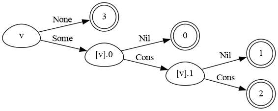
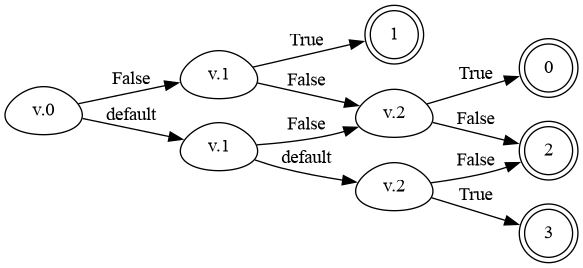
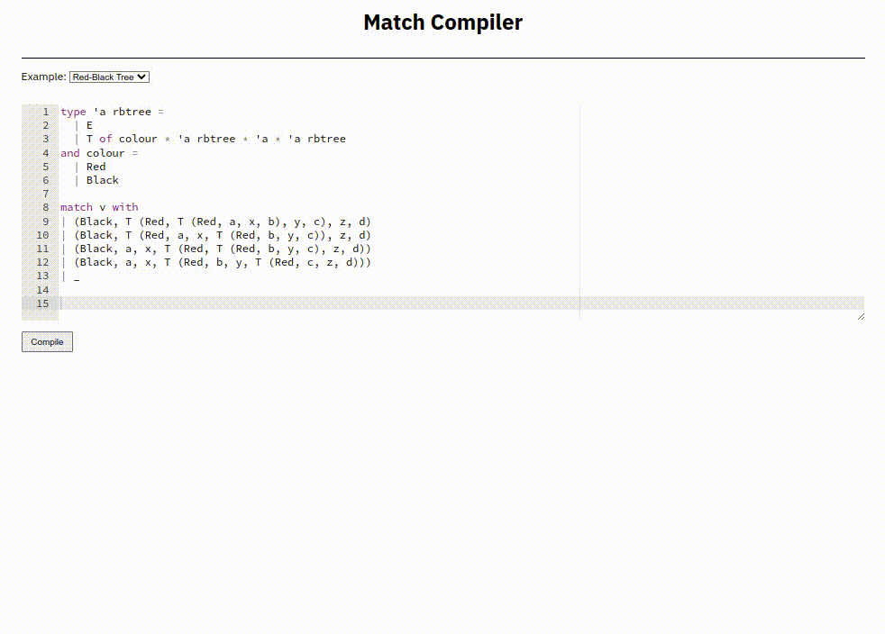

Implementation of the match compilation algorithm described in Maranget's
[Compiling Pattern Matching to Good Decision Trees](http://moscova.inria.fr/~maranget/papers/ml05e-maranget.pdf)
with DAG construction inspired by Pettersson's
[A Term Pattern-Match Compiler Inspired by Finite Automata Theory](https://www.classes.cs.uchicago.edu/archive/2011/spring/22620-1/papers/pettersson92.pdf).

---

The algorithm processes (typed) patterns into a pattern matrix and continually specialises the matrix based on the 
constructors present in the left-most column. Each specialisation corresponds to adding an edge in the decision tree 
(labelled with the associated constructor's tag). To avoid duplication, the decision "tree" is really constructed as a DAG by 
means of hash consing.

---

### Examples
```ocaml
match v with
| Some (Nil, _) -> 0
| Some (_, Nil) -> 1
| Some (Cons (x, xs), Cons (y, xs)) -> 2
| None -> 3
```


```ocaml
match v with
| (_, False, True) -> 0
| (False, True, _) -> 1
| (_, _, False)-> 2
| (_, _, True) -> 3
```


```ocaml
match v with
| (Black, T (Red, T (Red, a, x, b), y, c), z, d) -> 0
| (Black, T (Red, a, x, T (Red, b, y, c)), z, d) -> 1
| (Black, a, x, T (Red, T (Red, b, y, c), z, d)) -> 2
| (Black, a, x, T (Red, b, y, T (Red, c, z, d))) -> 3
| _ -> 4
```


---

There is a small web user interface for experimenting with the algorithm.
It provides nothing in the way of highlighting input errors, as it was intended to be 
used for a YouTube video about the algorithm.
You can find the tool hosted at my website [here](https://compiler.club/match).


